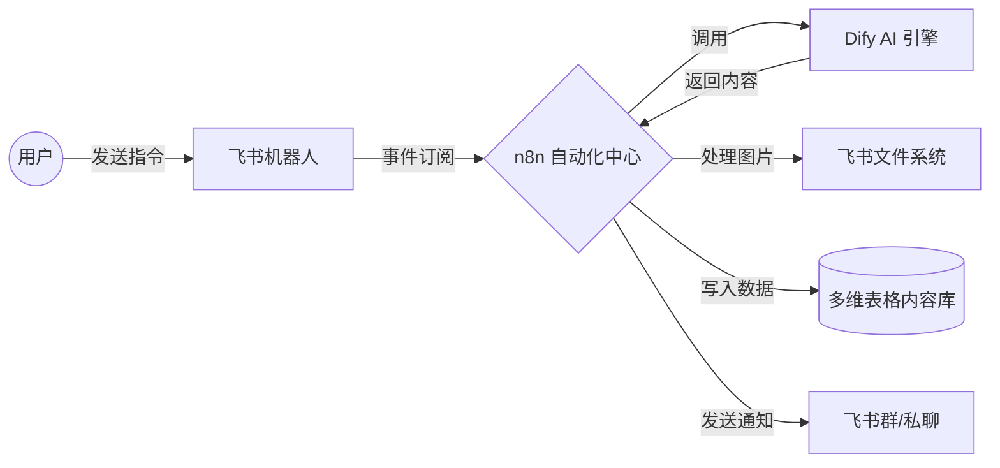

# 飞书智能内容创作助手 (Feishu Content Bot)

> **基于 n8n + Dify 的企业级 AI 自动化内容生产与管理流水线。**

## 🚀 项目概述

本项目是一款专为企业用户设计的**飞书智能内容机器人**。它通过集成大语言模型（LLM）能力，实现了从“用户指令”到“高质量内容生成”、“多媒体处理”以及“结构化数据存档”的全自动化流程。无论是自媒体文案、工作周报还是创意灵感，只需在飞书对话框发送一行指令，剩下的交由 AI 自动化处理。

## ✨ 核心特性

- **🤖 智能双引擎驱动**：融合 **n8n** 的逻辑编排能力与 **Dify** 的 LLM 应用架构，支持灵活的任务分发与复杂 Prompt 管理。
- **📝 多模态内容处理**：
    - **文字生成**：自动提取话题、生成标题、正文及标签。
    - **图片集成**：支持从 AI 响应中解析图片 Markdown，自动完成图片下载并上传至飞书文件系统。
- **📊 自动化数据中心**：生成的所有内容（包括文字、图片附件、生成成本、耗时等）将自动写入**飞书多维表格 (Bitable)**，打造企业私域内容库。
- **⚡ 极致用户体验**：
    - **即时回执**：支持“处理中”状态即时反馈，告示 AI 响应焦虑。
    - **幂等去重**：内置 12 小时事件去重逻辑，防止网络波动导致的重复生成。
- **🛡️ 企业级稳定性**：支持 Feishu Challenge 校验，具备完善的错误捕捉与异常通知机制。

## 🛠️ 技术栈

- **自动化编排**: [n8n](https://n8n.io/)
- **AI 编排策略**: [Dify](https://dify.ai/)
- **交互平台**: 飞书开放平台 (Lark Open Platform)
- **基础设施**: Docker / Docker Compose
- **数据存储**: 飞书多维表格 (Bitable)

## 📐 逻辑架构

## 💡 应用场景

1. **自媒体运营**：在手机上随时通过飞书发送关键词，数秒内生成符合小红书、抖音风格的爆款文案并自动存入选题库。
2. **灵感速记**：团队成员在群内讨论的创意，一键触发生成结构化笔记，方便后续查阅。
3. **内容资产管理**：自动记录每一条 AI 生成内容的成本、数量和质量，为运营决策提供数据支持。
